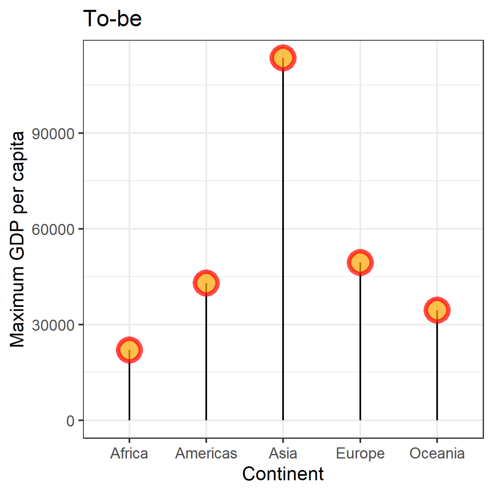

install.packages("tidyverse")
install.packages("dplyr")
install.packages("gapminder")
install.packages("forcats")
install.packages("here")
install.packages("ggrepel")
install.packages("ggpubr")
---

```{r setup, message = FALSE, warning = FALSE, include=FALSE}
knitr::opts_chunk$set(echo = TRUE)
library(tidyverse)
library(dplyr)
library(gapminder)
library(forcats)
library(here)
library(ggrepel)
library(ggpubr)
```

Exercise 1: Explain the value of the here::here package

Here::Here package is quite useful because this package makes it robust to access codes, no matter the file paths of different users. It can automatically adapt to different operating systems and directories. Only specifying the paths from the root directory to sub-directory is sufficient for users. In other words, its ability to detect the root directory and work platform-independently allows users to exchange and run codes without creating the same directories with the code owners. Using this package enhances the reproducibility of codes. 

Exercise 2: Factor management

Drop factor/levels

```{r}

gapminder <- gapminder::gapminder

#Explore continent variable from the gapminder dataset

gapminder$continent %>% class #Continent feature is a factor

gapminder$continent %>% levels #I will drop Oceania among these levels

gapminder$country %>% levels

nrow(gapminder) #Number of rows before dropping Oceania

#Before dropping, there are 1704 rows, 5 levels for continents, and 142 levels of countries

gap_drop <- gapminder %>% filter(continent != "Oceania") %>% droplevels

gap_drop$continent %>% levels

gap_drop$country %>% levels

nrow(gap_drop)

#After dropping, there are 1680 rows, 4 levels for continents, and 140 levels of countries

```

Reorder levels based on knowledge from data

```{r}

#Let's choose 25th quantile of life expectancy as the summary statistics for reordering

func <- function(x) {return(quantile(x, 0.25))}

#Reorder continent levels  

gap_drop2 <- gap_drop %>% mutate(continent = fct_reorder(continent, lifeExp, func, .desc = TRUE))
  

gap_drop2$continent %>% levels

#The order of the levels changed from "Africa" "Americas" "Asia" "Europe" to "Europe" "Americas" "Asia" "Africa"    


```

Explore the effects of re-leveling a factor in a tibble

```{r}

#Before re-leveling

gd2 <- gap_drop2 %>% arrange(continent) 

gd2 %>%
    ggplot( aes(x = continent, y = lifeExp, fill = continent)) + 
    geom_violin() +
    xlab("Continent") +
    theme(legend.position="none") +
    ylab("Life Expectancy")

#After re-leveling

gap_drop3 <- gap_drop2 %>% 
                mutate(continent = fct_relevel(continent, c("Asia", "Europe", "Africa", "Americas")))

gd3 <- gap_drop3 %>% arrange(continent) 

gd3 %>%
    ggplot( aes(x = continent, y = lifeExp, fill = continent)) + 
    geom_violin() +
    xlab("Continent") +
    theme(legend.position="none") +
    ylab("Life Expectancy")

```

Exercise 3: File input/output

```{r}

new_data <- gapminder[2:30, ] #A subset of the gapminder data

write_csv(new_data, here("Homework 5", "new_file.csv")) #Export

imported_data <- read_csv(here("Homework 5", "new_file.csv")) #Reload

imported_data 

#Data is reloaded successfully

gd4 <- imported_data %>%
         mutate(country = factor(country), #Convert from char to factor
         continent = factor(continent),
         continent = fct_reorder(continent, pop, mean, .desc = TRUE)) %>%
         arrange(continent)

gd4

gd4$continent %>% levels

```

Exercise 4: Visualization design

```{r}

#Max GDP per capita for each continent plot from Homework 3

p1 <- gapminder %>%
group_by(continent) %>%
summarize(maxGDPpercap = max(gdpPercap),
minGDPpercap = min(gdpPercap)) %>%
ggplot(aes(continent, maxGDPpercap)) +
geom_point(colour = "blue") +
geom_label_repel(aes(label = maxGDPpercap),
box.padding = 0.35,
point.padding = 0.5,
segment.color = 'grey50') +
ylab("max GDP per cap") + ggtitle("As-is")

#New plot

p2 <- gapminder %>%
group_by(continent) %>%
summarize(maxGDPpercap = max(gdpPercap)) %>%
ggplot(aes(x=continent, y=maxGDPpercap)) +
geom_segment(aes(x=continent, xend=continent, y=0, yend=maxGDPpercap)) +
geom_point( size=5, color="red", fill=alpha("orange", 0.3), alpha=0.7, shape=21, stroke=2)+
xlab("Continent") + ylab("Maximum GDP per capita") + ggtitle("To-be") +
theme_bw()


ggarrange(p1, p2, nrow = 1, ncol = 2) #Combine two plots


```

- In the first plot, it is very difficult to read the values corresponding to the y-axis. To solve this problem, I added labels showing the actual values. However, this made the first plot very cluttered. In the second plot, the y-axis is scaled according to the possible range.
- In the first plot, the background is gray. Having a colorful background makes the plot harder to interpret because of its distractive nature. To solve this problem, I changed the background color to white in the second plot.
- In the first plot, I used abbreviations to name the y-axis. In the second plot, I changed how I named the axes by openly writing the labels and making them more understandable for someone does not know the data.


Exercise 5: Writing figures to file

```{r}

ggsave(here("Homework 5", "To-be.png"), plot = p2, width = 4, height = 4) #Save the new plot as png

```



